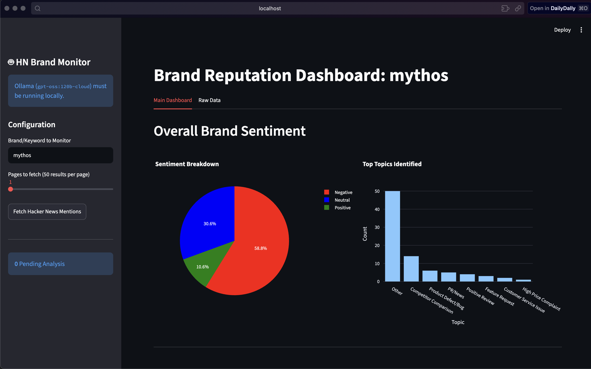
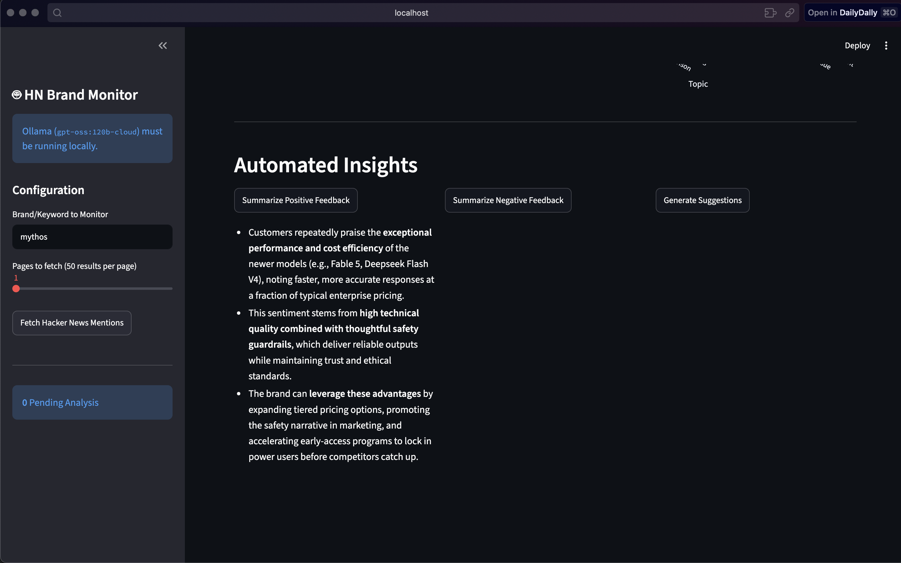
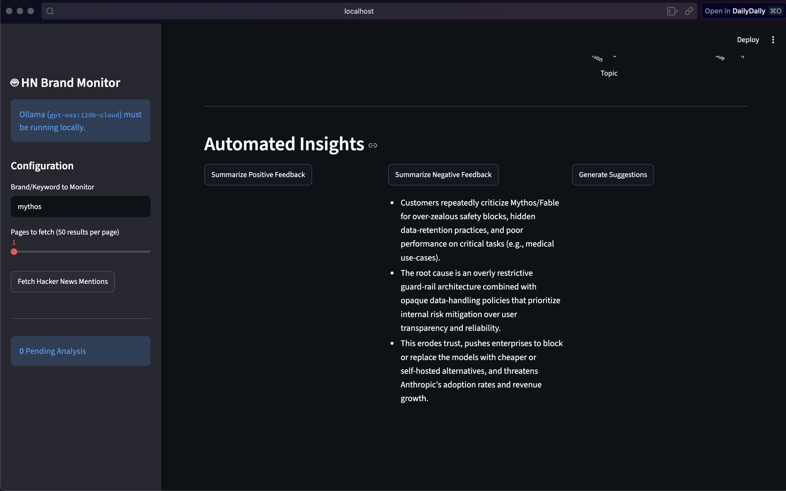

# 🔍 Hacker News Brand Monitor

> Track what Hacker News says about any brand - sentiment, topics, and AI summaries, all running locally.


---

## What it does

Paste any brand name or keyword, and this tool automatically:

- Fetches relevant comments from Hacker News via the Algolia API
- Stores them locally in a SQLite database (no duplicates)
- Runs each comment through a local LLM (Ollama) to detect **sentiment**, **topic**, and **urgency**
- Displays everything in an interactive Streamlit dashboard with charts
- Generates AI-written executive summaries for positive feedback, negative feedback, and product suggestions

All AI processing runs **on your machine** - nothing is sent to any external API.

---





## Dashboard Preview

| Feature | Description |
|---|---|
| Sentiment Breakdown | Pie chart - Positive / Negative / Neutral |
| Topic Categories | Bar chart - Bug, Feature Request, Price Complaint, etc. |
| Urgency Flags | High / Low urgency per mention |
| AI Summaries | One-click executive reports via Ollama |
| Raw Data Table | Full mention history with filters |

---

## Tech Stack

| Layer | Technology |
|---|---|
| Dashboard | Streamlit |
| AI / LLM | Ollama (local) |
| Database | SQLite |
| Data | Pandas, Plotly |
| News API | Algolia HN Search API |
| Deployment | Docker |
| Language | Python 3.10 |

---

## Getting Started

### Prerequisites
- [Ollama](https://ollama.com) installed and running locally
- Docker (optional, for containerised run)

### 1. Clone the repo
```bash
git clone https://github.com/prakhar-161/Hacker-news-monitoring-tool.git
cd Hacker-news-monitoring-tool
```

### 2. Pull the Ollama model
```bash
ollama pull gpt-oss:120b-cloud
```

### 3. Install dependencies
```bash
pip install -r requirements.txt
```

### 4. Run the app
```bash
streamlit run main.py
```

Open **http://localhost:8501** in your browser.

---

## Run with Docker

### Build the image
```bash
docker build -t hacker-news-monitor .
```

### Run the container
```bash
touch brand_monitor.db

docker run -d -p 8501:8501 \
  -v "$PWD/brand_monitor.db:/app/brand_monitor.db" \
  -e OLLAMA_HOST="http://host.docker.internal:11434" \
  --name my-brand-monitor \
  hacker-news-monitor:latest
```

Open **http://localhost:8501** in your browser.

> **Note:** Ollama must be running on your host machine. The `OLLAMA_HOST` env variable points the container to it via `host.docker.internal`.

---

## Project Structure

```
hacker-news-monitoring-tool/
├── main.py               # Streamlit dashboard
├── backend_utils.py      # DB, fetching, AI analysis, summaries
├── requirements.txt
├── Dockerfile
└── brand_monitor.db      # Auto-created SQLite database
```

---

## How It Works

```
Hacker News (Algolia API)
        │
        ▼
  Fetch comments for brand
        │
        ▼
  Deduplicate & store in SQLite
        │
        ▼
  Ollama (local LLM)
  ├── Sentiment  →  Positive / Negative / Neutral
  ├── Topic      →  Bug / Feature Request / Price Complaint / ...
  └── Urgency    →  High / Low
        │
        ▼
  Streamlit Dashboard
  ├── Charts & metrics
  └── AI executive summaries
```

---

## Docker Hub

```bash
docker pull prxkhxr/hacker-news-monitor:1.0
```
